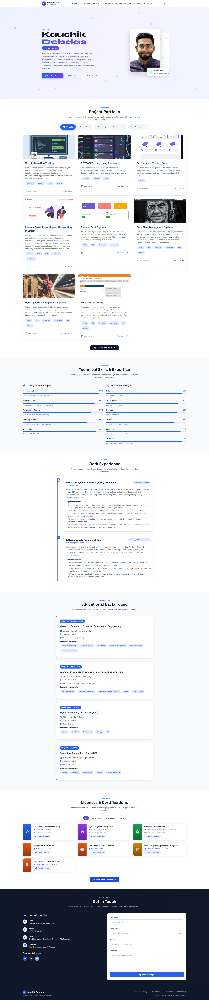

# 👨‍💻 Kaushik Debdas — Portfolio Website



> A modern, fully responsive personal portfolio website for a Software Quality Assurance Engineer — built with vanilla JavaScript, Tailwind CSS, and a clean modular architecture.

[](https://kaushikdebdas.github.io)

---

## 📋 Table of Contents

- [Features](#-features)
- [Folder Structure](#-folder-structure)
- [File Descriptions](#-file-descriptions)
- [How It Works](#-how-it-works)
- [Getting Started](#-getting-started)
- [Customisation Guide](#-customisation-guide)
- [Technologies Used](#-technologies-used)
- [Contributing](#-contributing)

---

## ✨ Features

- ⚡ **Fast & Lightweight** — No build tools, no bundlers. Pure HTML/CSS/JS.
- 🌙 **Dark / Light Mode** — Persisted via `localStorage`, respects system preference.
- 📱 **Fully Responsive** — Mobile-first design that works on all screen sizes.
- 🎨 **Smooth Animations** — CSS keyframe animations with scroll-triggered effects.
- 🗂️ **Data-Driven** — All content (projects, skills, experience, education) lives in `data.js`. Update one file to refresh the entire site.
- 🔍 **Project Filter** — Filter projects by category (Automation, API, Performance, Web Dev).
- 📬 **Contact Form** — Client-side validated form with notification feedback.
- ♿ **Accessible** — Semantic HTML5, ARIA labels, keyboard navigable.

---

## 📁 Folder Structure

```
portfolio/
│
├── index.html                  ← Main entry point (clean, no inline JS/CSS)
│
├── assets/
│   ├── css/
│   │   ├── style.css           ← Global styles, variables, layout, cert cards
│   │   └── animations.css      ← Keyframes, project cards, education cards, filter buttons
│   │
│   ├── js/
│   │   ├── data.js             ← ★ ALL content data (edit here to update the site)
│   │   ├── renderers.js        ← HTML template functions (one per section)
│   │   ├── theme.js            ← Dark/light mode manager
│   │   ├── utils.js            ← Shared utilities (notifications, filter, debounce)
│   │   └── main.js             ← App entry point — wires everything together
│   │
│   ├── images/
│   │   ├── profile.jpg         ← Your profile photo
│   │   └── projects/           ← Project screenshot images
│   │       ├── webautomation.jpg
│   │       ├── restAPI.jpg
│   │       ├── performance.png
│   │       └── ...
│   │
│   └── resume/
│       └── Kaushik_Debdas_CV.pdf   ← Downloadable CV
│
├── README.md                   ← You are here
└── .vscode/
    └── settings.json           ← VS Code Live Server config (port 5501)
```

---

## 📄 File Descriptions

### `index.html`
The **only** HTML file. Fully semantic and clean — no inline styles or scripts.

- Loads external libraries (Tailwind, Font Awesome, Google Fonts) from CDN.
- Sets up Tailwind's dark mode config and custom colour tokens.
- Contains all section skeletons (`<section id="...">`) with placeholder `div` IDs.
- Scripts are loaded at the **bottom** in dependency order:
  `data.js` → `renderers.js` → `theme.js` → `utils.js` → `main.js`

---

### `assets/css/style.css`
Global stylesheet covering:
- CSS custom properties (colour tokens, spacing)
- Base resets and typography
- Navigation bar styles
- Hero section layout
- Certificate card (`.cert-card`, `.cert-card-accent`, `.cert-card-body`) styles
- Skills section progress bar styles
- Contact section and form styles
- Footer styles
- Utility classes

---

### `assets/css/animations.css`
All animation-related CSS:
- `@keyframes` definitions: `fadeIn`, `slideUp`, `float`, `glow`, `tilt`, `fadeInUp`, `slideInLeft`, `fadeInScale`
- Animation utility classes: `.animate-fade-in`, `.animate-slide-up`, `.animate-float`, `.animate-glow`
- **Project card** styles and hover effects
- **Education card** styles
- **Filter button** active/hover states
- Mobile responsive overrides (`@media` queries)

---

### `assets/js/data.js`
**⭐ The single source of truth for all content.**

| Export | Description |
|---|---|
| `navigationItems` | Nav links (label, href, icon) |
| `projects` | Project cards (title, description, tech stack, images, links, category) |
| `testingMethodologies` | Skill bars for testing methods |
| `toolsTechnologies` | Skill bars for tools |
| `workExperience` | Timeline entries (title, company, period, achievements) |
| `educationData` | Degree cards (institution, period, courses, achievements) |
| `certificatesData` | Certificate cards (issuer, date, credential ID, link, colour) |
| `contactInfo` | Email, phone, location, LinkedIn |
| `socialLinks` | LinkedIn, GitHub, Twitter |
| `footerLinks` | Privacy, Terms, Sitemap links |

**To add a new project**, simply push a new object into the `projects` array.

---

### `assets/js/renderers.js`
Pure template functions — each takes data and returns an HTML string.

| Method | Renders |
|---|---|
| `renderNavItems(items)` | `<li>` nav links |
| `renderProjectCards(items)` | Project grid cards with image, overlay, tags |
| `renderSkillBars(items)` | Skill name + animated progress bar |
| `renderExperienceTimeline(items)` | Timeline entries with achievement lists |
| `renderEducationCards(items)` | Education cards with coursework tags |
| `renderCertificateCards(items)` | Certificate cards with verify link |
| `renderContactInfo(items)` | Icon + label contact rows |
| `renderSocialLinks(items)` | Circular social icon buttons |
| `renderFooterLinks(items)` | Footer anchor links |

---

### `assets/js/theme.js`
Manages dark/light mode via the `ThemeManager` object.

| Method | Purpose |
|---|---|
| `setTheme(theme)` | Applies `dark` class to `<html>`, saves to `localStorage` |
| `toggleTheme()` | Flips between dark and light |
| `updateThemeIcons()` | Syncs moon/sun icon visibility |
| `initTheme()` | Reads saved preference or system preference on load |

---

### `assets/js/utils.js`
Shared utility functions via the `PortfolioUtils` object.

| Method | Purpose |
|---|---|
| `showNotification(msg, type)` | Slide-in toast notification (success / error) |
| `sanitizeInput(input)` | Escapes HTML to prevent XSS in form inputs |
| `filterProjects(category)` | Shows/hides project cards by `data-category` |
| `debounce(func, wait)` | Throttles scroll event handler for performance |

---

### `assets/js/main.js`
**App entry point.** Runs on `DOMContentLoaded`:

1. Initialises theme (`ThemeManager.initTheme()`)
2. Calls each `Renderers.*` method and injects HTML into the DOM
3. Sets up `IntersectionObserver` to animate skill bars on scroll
4. Wires up project filter buttons
5. Handles mobile menu toggle (open/close, icon swap)
6. Handles contact form submission with loading state and notification
7. Implements smooth scrolling for all `a[href^="#"]` links
8. Tracks the active nav section on scroll with debouncing

---

## 🚀 Getting Started

### Option 1 — Open directly
Just open `index.html` in any modern browser. No build step needed.

### Option 2 — VS Code Live Server (recommended)
1. Install the [Live Server](https://marketplace.visualstudio.com/items?itemName=ritwickdey.LiveServer) extension.
2. Right-click `index.html` → **Open with Live Server**.
3. The site runs at `http://127.0.0.1:5501` (configured in `.vscode/settings.json`).

### Option 3 — GitHub Pages
1. Push this repo to GitHub.
2. Go to **Settings → Pages → Source → Deploy from branch → main / root**.
3. Your site will be live at `https://<username>.github.io/<repo-name>`.

---

## 🎨 Customisation Guide

### Update personal information
Edit `assets/js/data.js` — all arrays at the top of the file control every section.

### Change colour scheme
Open `index.html` and find the Tailwind config block:
```javascript
tailwind.config = {
    theme: {
        extend: {
            colors: {
                primary:   '#2563eb',   // ← change this
                secondary: '#1e293b',
                accent:    '#10b981'
            }
        }
    }
};
```

### Add a new section
1. Add a `<section id="new-section">` block in `index.html`.
2. Add a nav item to `navigationItems` in `data.js`.
3. Add a data array and renderer method in `renderers.js`.
4. Call the renderer in `main.js`.

### Connect the contact form
In `main.js`, find the `contact-form` submit handler and replace the `setTimeout` simulation with a real API call (e.g. EmailJS, Formspree, or your own backend).

---

## 🛠️ Technologies Used

| Technology | Purpose |
|---|---|
| HTML5 | Semantic page structure |
| Tailwind CSS (CDN) | Utility-first styling and dark mode |
| Vanilla JavaScript (ES6+) | All interactivity and DOM rendering |
| CSS3 Animations | Keyframe animations and transitions |
| Font Awesome 6 | Icons throughout the site |
| Google Fonts (Inter) | Typography |

---

## 🙌 Contributing

Pull requests are welcome! For major changes, please open an issue first to discuss what you'd like to change.

---

*Built with ❤️ by [Kaushik Debdas](https://github.com/KaushikDebdas)*
